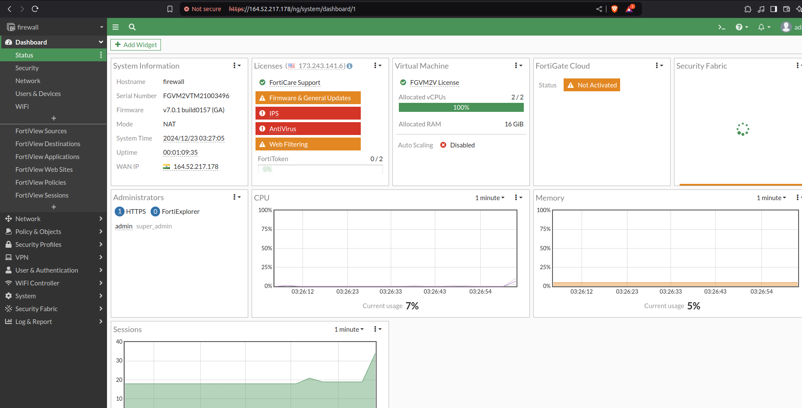
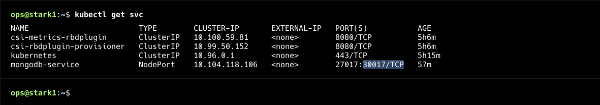
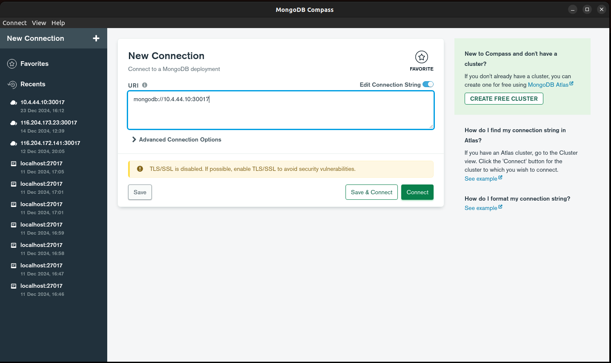
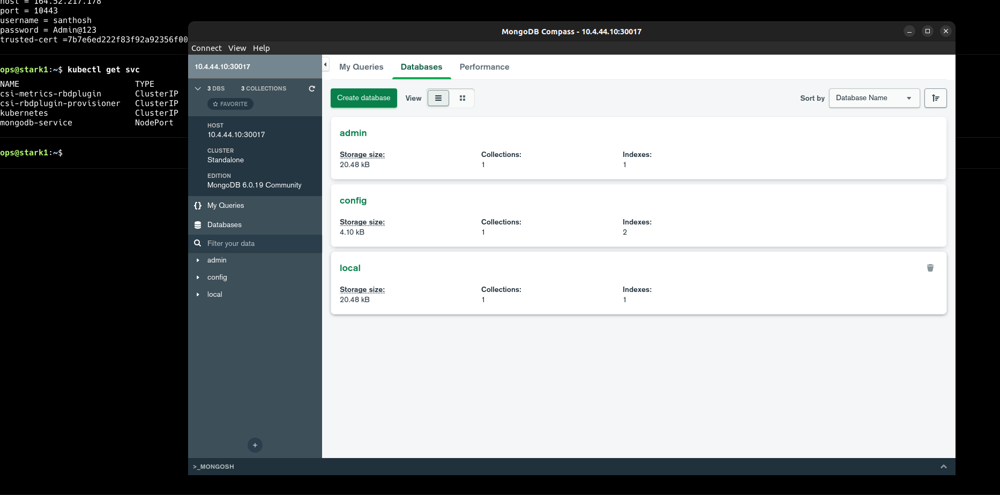
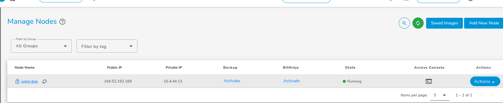
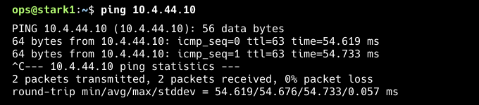

# How to Access Kubernetes Database Service

## Prerequisites

Before accessing the database, ensure the following:

1. A Kubernetes cluster is set up in the E2E environment.
2. The database pods are deployed, and a NodePort service is configured.
3. Access to the same VPC as the Kubernetes cluster.

## Access Methods

### Method 1: Using SSL VPN

1. **Create a Firewall in the Same VPC as the Kubernetes Cluster**  
   Ensure that the firewall is created under the same VPC used to create your Kubernetes cluster.

2. **Log in to the Firewall**  
   Open the FortiGate firewall dashboard using your email credentials.

   

3. **Configure SSL VPN**  
   Follow the provided [documentation](https://docs.google.com/document/d/1ja7qRqF462CqG-V5GSnTSpn7HxjJLJXVxPz2pgKGA/edit?tab=t.0) to configure SSL VPN for the firewall.

4. **Set Up a NodePort Service for Database Pods**  
   Create a NodePort service for your database pods, deployment, or StatefulSet. Example YAML configuration:

   ```yaml
   apiVersion: v1
   kind: Service
   metadata:
     name: db-service
   spec:
     type: NodePort
     ports:
       - port: 27017
         targetPort: 27017
         nodePort: 30017
     selector:
       app: database
   ```

5. **Verify the Service and Pods**  
   Use the following commands to check the status:

   ```bash
   kubectl get pods
   kubectl get svc
   ```

   

6. **Connect to the SSL VPN**  
   On your local machine, connect to the SSL VPN. Once connected, ensure you can ping any Kubernetes worker nodes to verify connectivity.

7. **Access the Database**  
   Use a database client like MongoDB Compass to connect to the database service using any worker node's VPC IP and the configured NodePort.

   

8. **Output of MongoDB Compass**  
   Verify the database connection.

   

---

### Method 2: Access the Kubernetes Database Service Using a Jump Server

1. **Create a Jump Server**  
   Set up a jump server under the same VPC as your Kubernetes cluster.

   

2. **Configure XRDP for GUI Access**  
   Install and configure XRDP on the jump server to enable GUI-based access.

3. **Set Up a NodePort Service for Database Pods**  
   Create a NodePort service for your database pods, deployment, or StatefulSet. Example YAML configuration:

   ```yaml
   apiVersion: v1
   kind: Service
   metadata:
     name: db-service
   spec:
     type: NodePort
     ports:
       - port: 27017
         targetPort: 27017
         nodePort: 30017
     selector:
       app: database
   ```

4. **Install a MongoDB Client Tool**  
   On the jump server, install a MongoDB client tool to connect to the database.

5. **Ping Jump Server**  
   Verify connectivity to the jump server.

   

6. **Access the Database**  
   Use any worker node's IP and the configured NodePort to access the database
